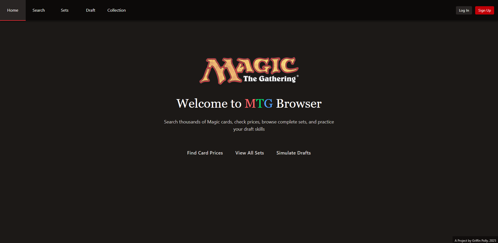
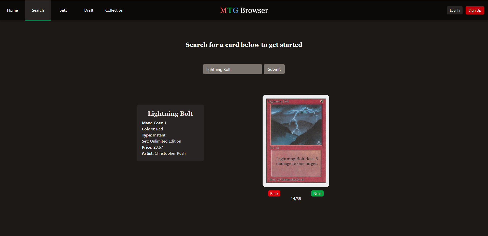
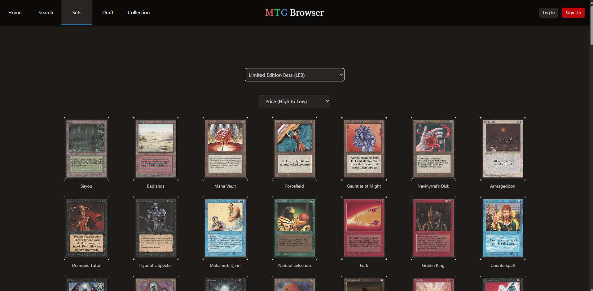
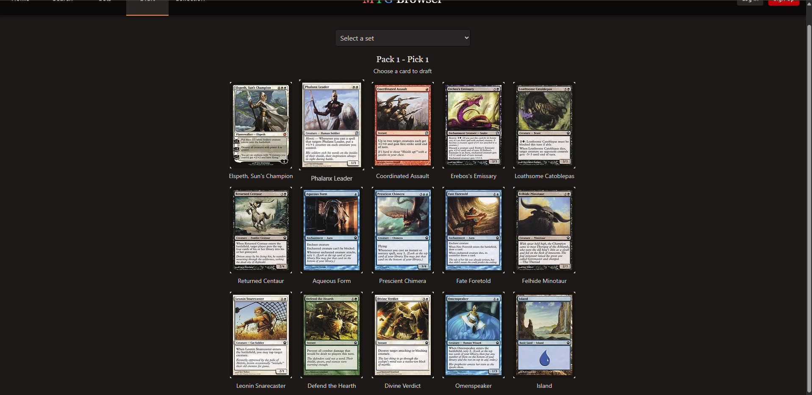
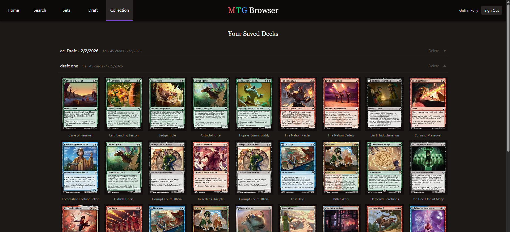

# MTG Browser

A full-stack Magic: The Gathering web application that lets users search every printed card, browse complete sets, simulate booster drafts against AI opponents, and save decks to a personal collection — all powered by a 30,000+ card database and serving 200+ unique users globally.

**[Deployed application — mtgbrowser.com](https://www.mtgbrowser.com)**



## Features

**Card Search** — Real-time autocomplete across 30,000+ cards with keyboard navigation.
<br>Uses AbortController to cancel in-flight requests on each keystroke, deduplicates results, and ranks suggestions by relevance.



**Set Browser** — Browse any MTG set and sort cards by name, mana cost, rarity, or price.
<br>Displays every printing with a responsive card grid powered by the Scryfall API.



**Draft Simulator** — Simulate an 8-player booster draft with AI opponents across 3 rounds of 15 picks.
<br>Packs follow real MTG booster composition and bots use a rarity-weighted pick algorithm. Save your final deck when the draft is complete.



**User Accounts & Deck Collection** — Sign up with email and password to save drafted decks to your personal collection.
<br>Secured with bcrypt hashing and JWT sessions via NextAuth. View, expand, and delete saved decks at any time.



## Tech Stack

**Frontend:** React, Next.js, TypeScript, Tailwind CSS

**Backend:** Next.js API Routes (Node.js), NextAuth (JWT), MongoDB, Mongoose

**External:** Scryfall API · Deployed on Vercel

## Getting Started Locally

```bash
git clone https://github.com/Griffin1610/next-MTG-browser.git
cd next-MTG-browser
npm install
```

Create a `.env.local`:

```env
MONGODB_URI=your_mongodb_connection_string
AUTH_SECRET=your_nextauth_secret
```

```bash
npm run dev
```

Open [http://localhost:3000](http://localhost:3000) to view the app.
